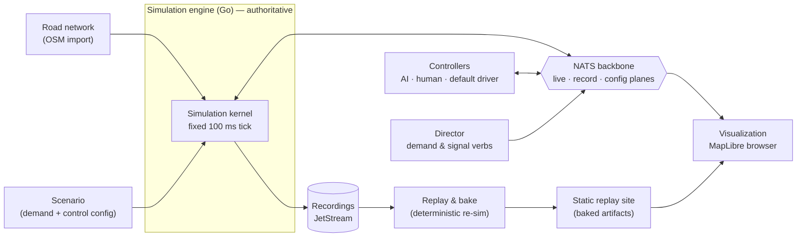
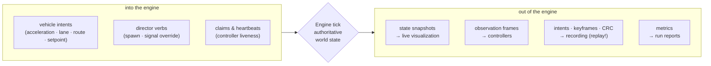
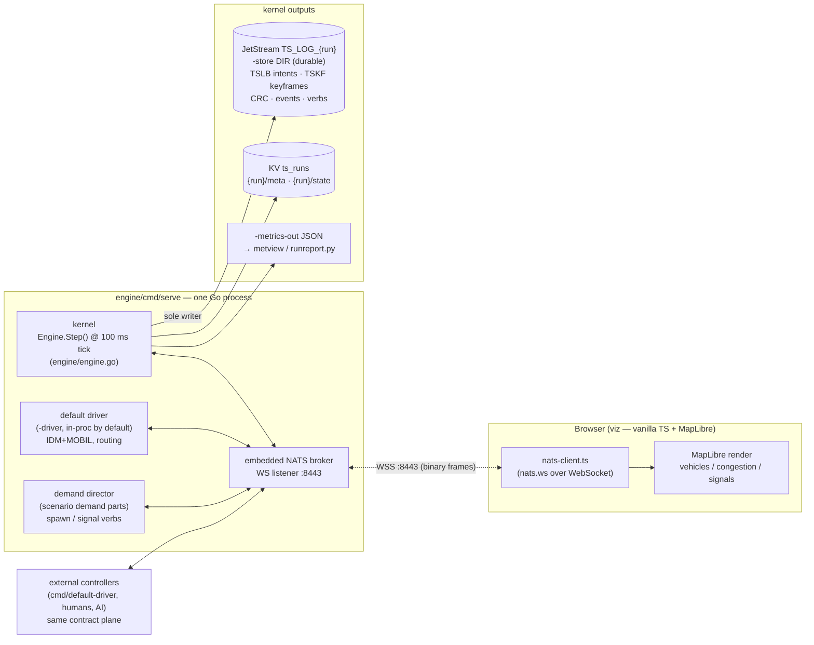
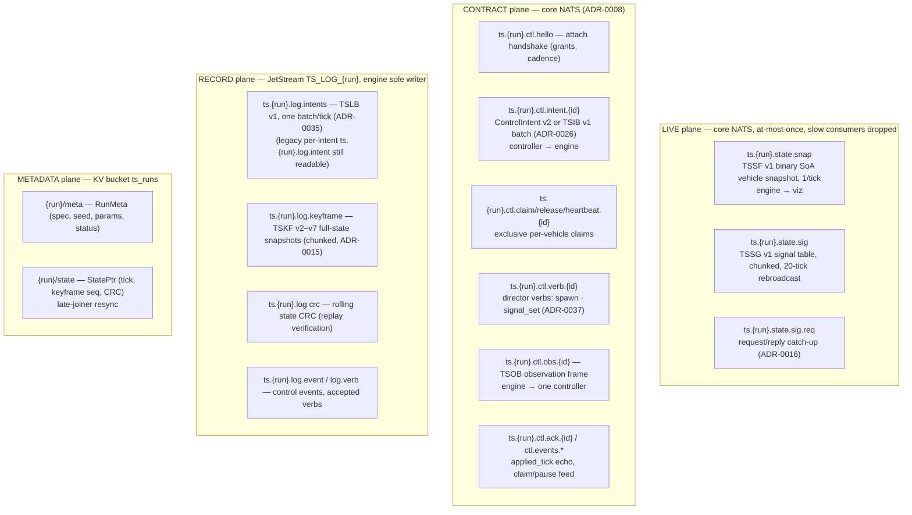
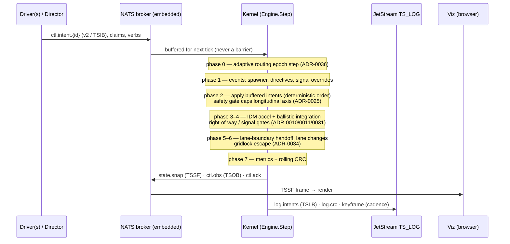
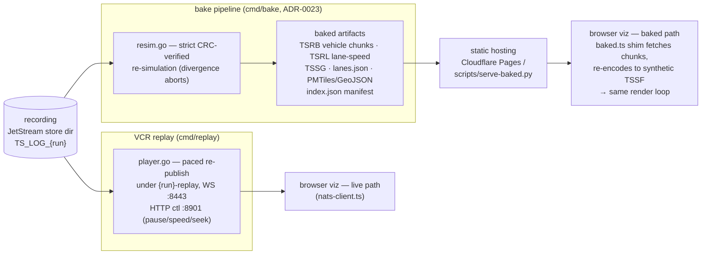
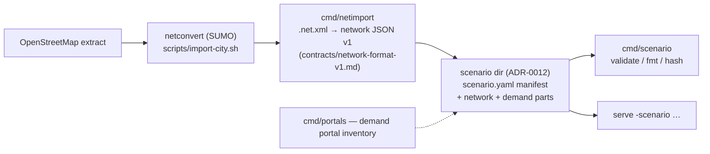
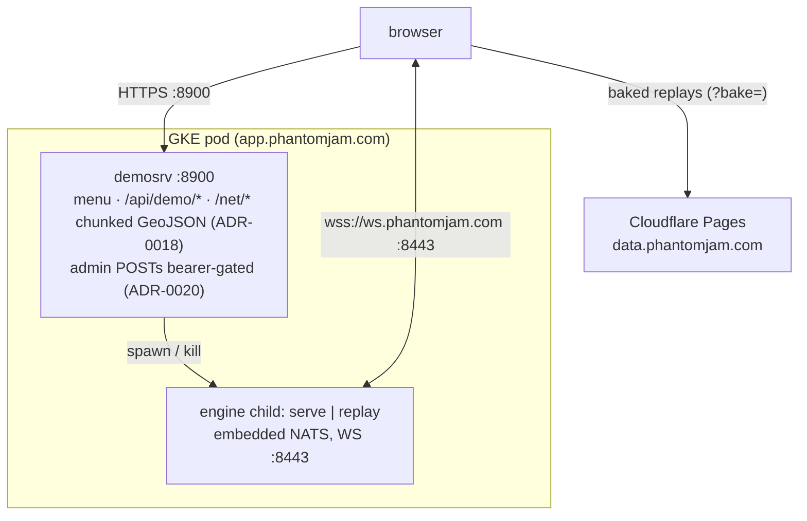

# Architecture & Data Flow (mermaid)

> Rendered from the code as of 2026-07-31 (`engine/`, `viz/src/`, `contracts/asyncapi.yaml` v2.7.0).
> The message contract is the source of truth for subjects and wire formats
> (`contracts/asyncapi.yaml`); these diagrams are a map, not a contract.
> Drift audit of the same date: see the reconciliation note in `docs/kb/INDEX.md`.

## High level

### 1. System architecture

The engine is the single authority over world state; everything else — drivers,
directors, viewers, replay — is a NATS client or a file consumer.

### 2. Data flow — what crosses the engine boundary

### 3. Tick cycle — one 100 ms step

Controllers are asynchronous at the edges; inside the tick everything is
deterministic and ordered. Intents arrive any time and are batch-applied in
phase 2 of the next tick.

```mermaid
flowchart LR
    P0["0 · adaptive routing<br/>freeze epoch weights"]
    P1["1 · events<br/>spawn · directives<br/>signal overrides"]
    P2["2 · apply intents<br/>deterministic order<br/>safety gate"]
    P3["3 · car-following<br/>IDM acceleration"]
    P4["4 · integrate<br/>ballistic motion"]
    P5["5 · lane boundaries<br/>junction gates<br/>spawn / despawn"]
    P6["6 · lane changes<br/>commanded / MOBIL"]
    P7["7 · metrics + CRC<br/>publish snapshot"]

    P0 --> P1 --> P2 --> P3 --> P4 --> P5 --> P6 --> P7
    P7 -->|"next tick (10 Hz)"| P0

    click P0 "https://github.com/eanderson4/traffic-sim/blob/main/engine/routing.go" "engine/routing.go — adaptive routing (ADR-0036)"
    click P3 "https://github.com/eanderson4/traffic-sim/blob/main/engine/vehicle.go" "engine/vehicle.go — idmAccel (IDM)"
    click P6 "https://github.com/eanderson4/traffic-sim/blob/main/engine/mobil.go" "engine/mobil.go — MOBIL lane changes"
```

---

## Detailed reference

## 4. Live run — components and data flow

One `serve` process *is* the system for a live run: the NATS broker is embedded
in-process, the default driver and demand director run alongside the kernel, and
browsers attach over the broker's WebSocket listener.

## 5. NATS planes and subjects

Three planes per ADR-0006, taxonomy `ts.{run}.{plane}.>`:

## 6. One tick — sequence

Fixed 100 ms authoritative tick (ADR-0005); controllers are async at the edges,
intents batch-applied inside the tick. Phase order per `engine/engine.go`:

## 7. Recording, replay, and baked replay

## 8. Network & scenario authoring pipeline

## 9. Deployment shape (as built)

ADR-0004 says local-first via docker-compose, but no compose file exists; the
actual deploy is a single GKE pod (`deploy/k8s/`): `demosrv` (HTTP :8900, serves
the viz menu + built app, spawns/kills one engine child) supervising `serve` or
`replay` (embedded broker, WS :8443). Baked replays bypass the pod entirely —
the browser reads static files straight from Cloudflare Pages.

