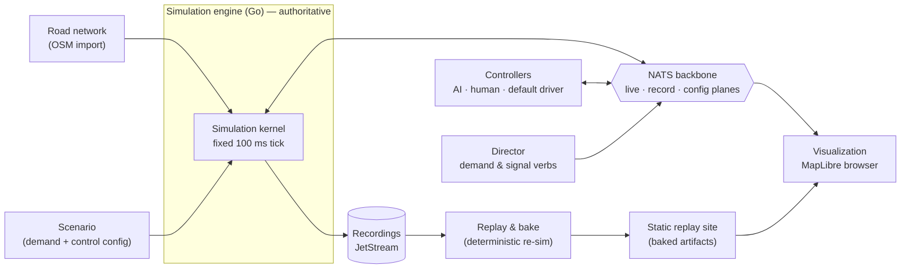
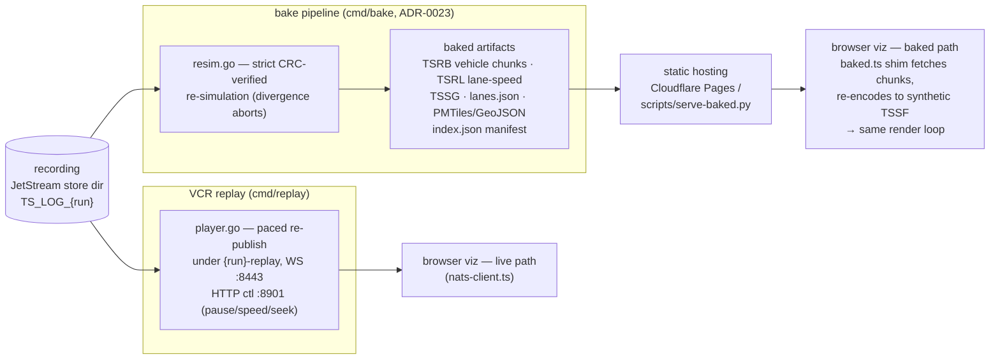

# Architecture & Data Flow (mermaid)

> Rendered from the code as of 2026-07-31 (`engine/`, `viz/src/`, `contracts/asyncapi.yaml` v2.7.0).
> The message contract is the source of truth for subjects and wire formats
> (`contracts/asyncapi.yaml`); these diagrams are a map, not a contract.
> Drift audit of the same date: see the reconciliation note in `docs/kb/INDEX.md`.
> **Core nodes are clickable on GitHub** — they link to the source each box is drawn from.

## 1. System architecture

The engine is the single authority over world state; everything else — drivers,
directors, viewers, replay — is a NATS client or a file consumer.



## 2. Tick cycle — one 100 ms step

Controllers are asynchronous at the edges; inside the tick everything is
deterministic and ordered. Intents arrive any time and are batch-applied in
phase 2 of the next tick.

```mermaid
flowchart LR
    P0["0 · adaptive routing<br/>freeze epoch weights"]
    P1["1 · events<br/>spawn · directives<br/>signal overrides"]
    P2["2 · apply intents<br/>deterministic order<br/>safety gate"]
    P3["3 · car-following<br/>IDM acceleration"]
    P4["4 · integrate<br/>ballistic motion"]
    P5["5 · lane boundaries<br/>junction gates<br/>spawn / despawn"]
    P6["6 · lane changes<br/>commanded / MOBIL"]
    P7["7 · metrics + CRC<br/>publish snapshot"]

    P0 --> P1 --> P2 --> P3 --> P4 --> P5 --> P6 --> P7
    P7 -->|"next tick (10 Hz)"| P0

    click P0 "https://github.com/eanderson4/traffic-sim/blob/main/engine/routing.go" "engine/routing.go — adaptive routing (ADR-0036)"
    click P3 "https://github.com/eanderson4/traffic-sim/blob/main/engine/vehicle.go" "engine/vehicle.go — idmAccel (IDM)"
    click P6 "https://github.com/eanderson4/traffic-sim/blob/main/engine/mobil.go" "engine/mobil.go — MOBIL lane changes"
```



## 3. One tick — sequence

Fixed 100 ms authoritative tick (ADR-0005); controllers are async at the edges,
intents batch-applied inside the tick. Phase order per `engine/engine.go`:

```mermaid
sequenceDiagram
    participant D as Driver(s) / Director
    participant B as NATS broker (embedded)
    participant E as Kernel (Engine.Step)
    participant J as JetStream TS_LOG
    participant V as Viz (browser)

    D->>B: ctl.intent.{id} (v2 / TSIB), claims, verbs
    B->>E: buffered for next tick (never a barrier)
    Note over E: phase 0 — adaptive routing epoch step (ADR-0036)
    Note over E: phase 1 — events: spawner, directives, signal overrides
    Note over E: phase 2 — apply buffered intents (deterministic order)<br/>safety gate caps longitudinal axis (ADR-0025)
    Note over E: phase 3–4 — IDM accel + ballistic integration<br/>right-of-way / signal gates (ADR-0010/0011/0031)
    Note over E: phase 5–6 — lane-boundary handoff, lane changes<br/>gridlock escape (ADR-0034)
    Note over E: phase 7 — metrics + rolling CRC
    E->>B: state.snap (TSSF) · ctl.obs (TSOB) · ctl.ack
    B->>V: TSSF frame → render
    E->>J: log.intent (per-message; TSLB batch under -log-batch) · log.crc · keyframe (cadence)
```

## 4. Recording, replay, and baked replay

Every live run is recorded to JetStream. From there two read paths: a VCR-style
replay that re-publishes the live plane, and the bake pipeline — a strict
CRC-verified re-simulation that produces static artifacts the browser renders
with no server at all.


